# InfluxDB bridge

Save your device states to an InfluxDB.

In order to use this addon you need a running InfluxDB instance.

The repo contains a docker-compose config (`docker-compose.yml`) which runs InfluxDB and Grafana locally.

# How to use
* Go to `settings/developer` and click `Create local authorization`
* Create a new token and copy it
* Go to the settings of the influxdb bridge and insert the copied token

# Getting started with Grafana
## Execute `docker-compose up` in a terminal

## Open http://localhost:3000 in a Browser and login with admin/admin
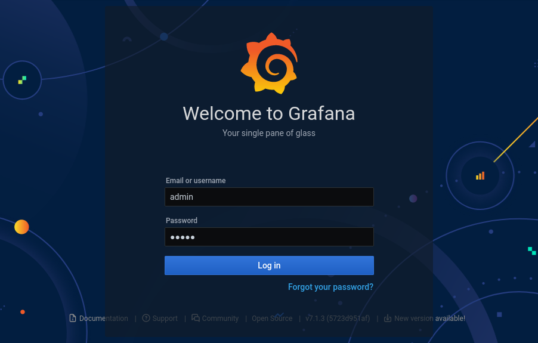

## Set a new password
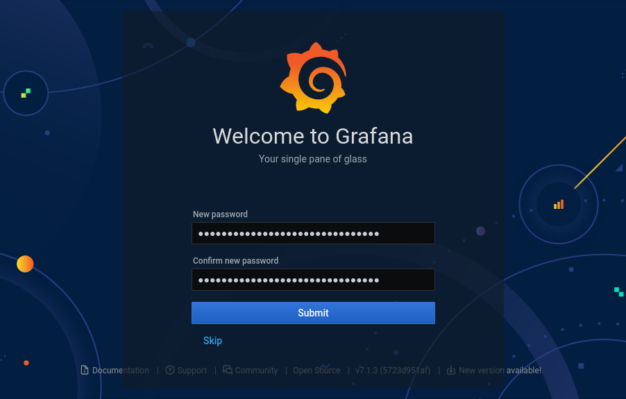

## Go to data sources
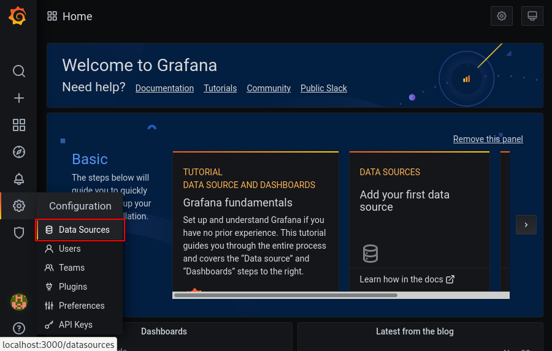

## Add a new data source
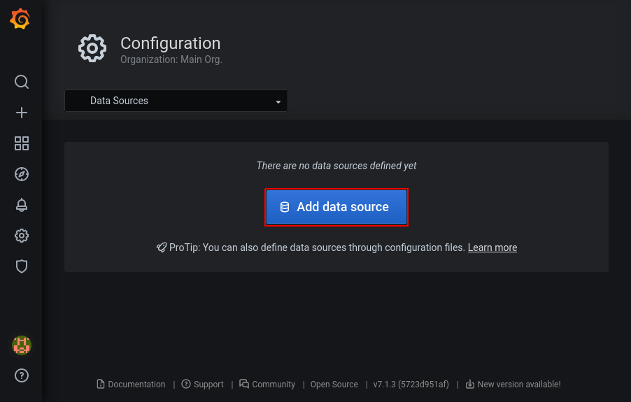

## Select InfluxDB
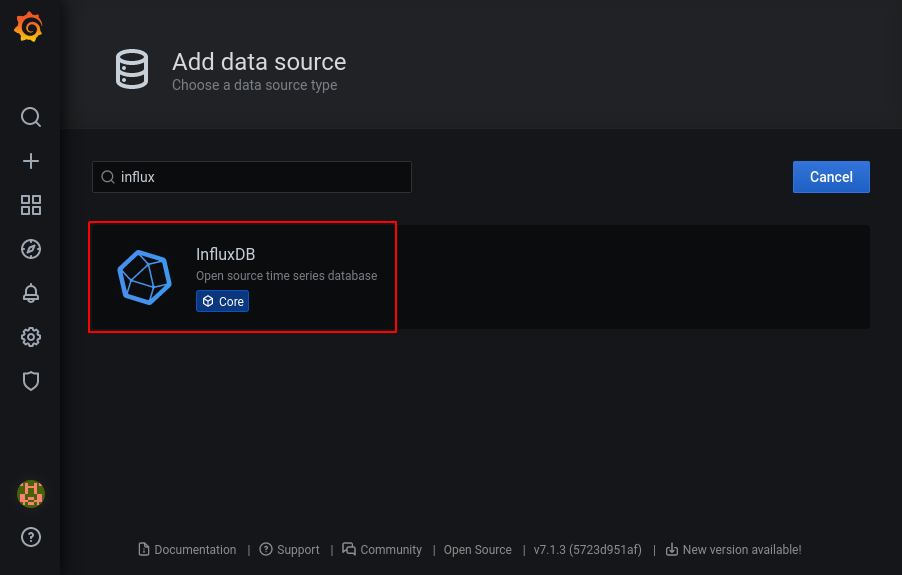

## Give the data source a name and set the url to the InfluxDB instance
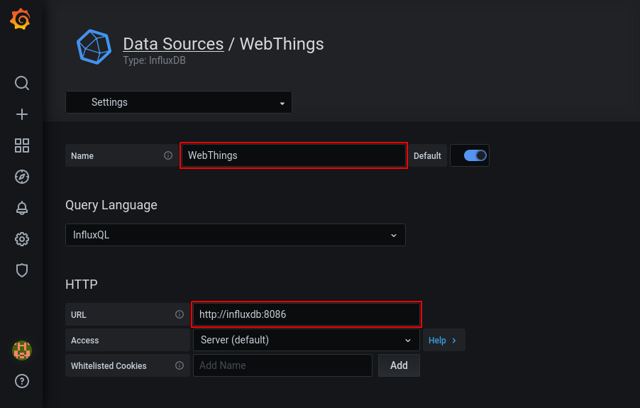

## Set the DB name you used in the adapter config
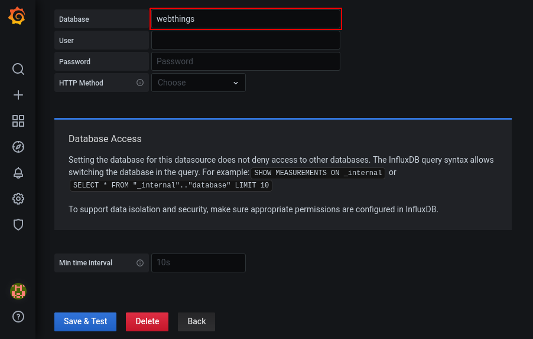

## Save the data source
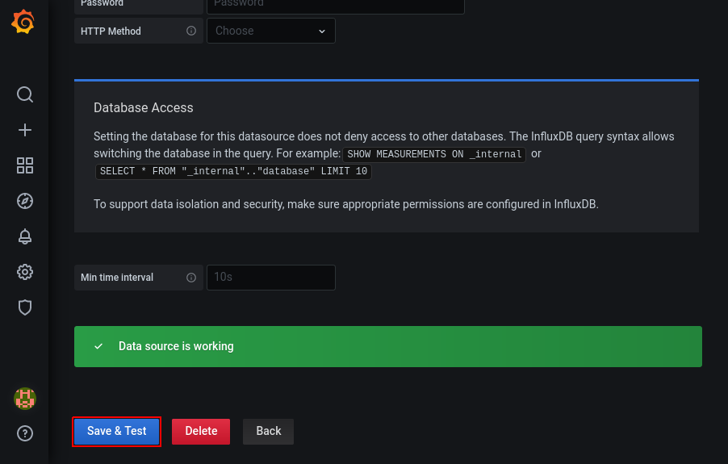

## Create a new dashboard
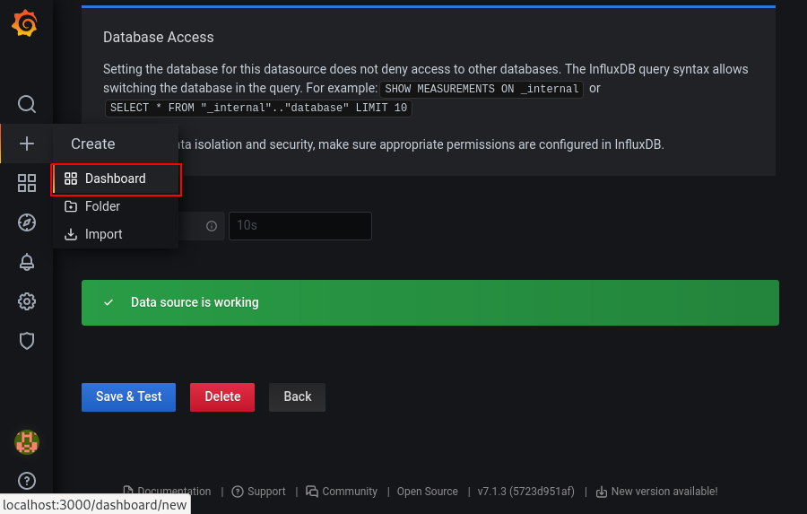

## Add a new panel
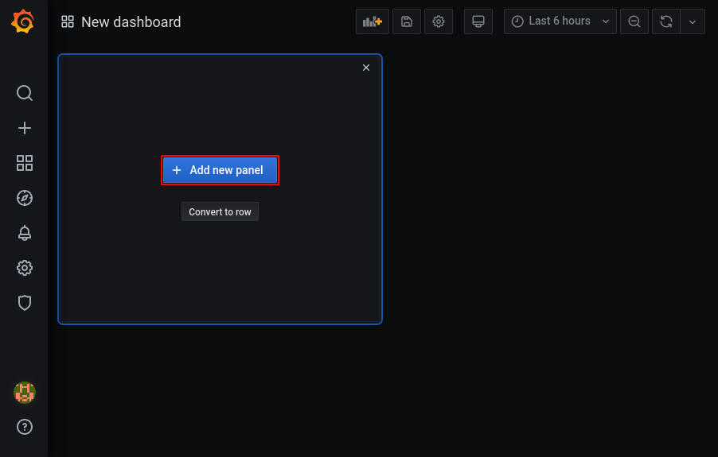

## Edit the panel and click on apply
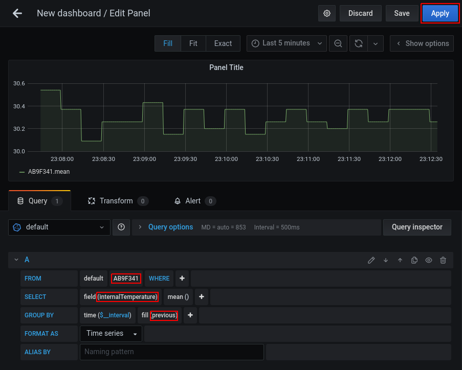

## Save the dashboard
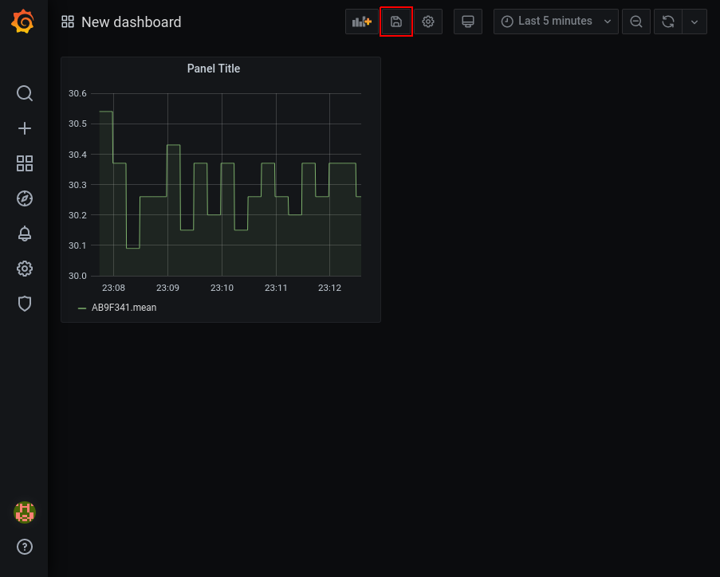

## Enter a name for the dashboard and click on save
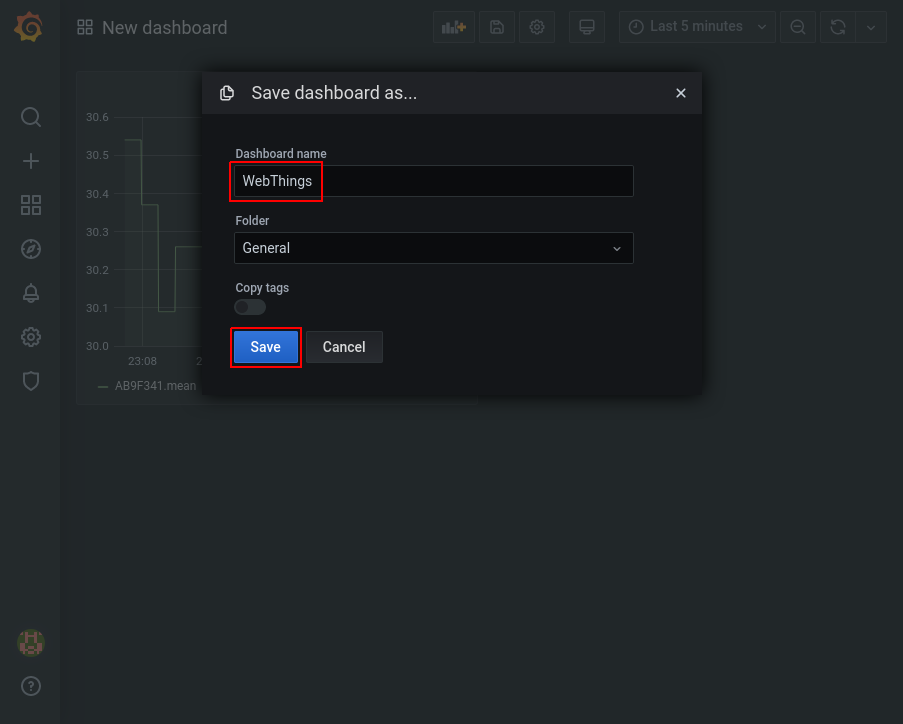
